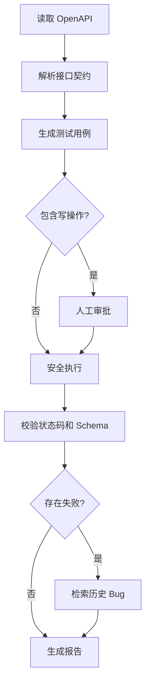

# TestPilot Lite

一个只测试**自己创建的本地 API**的学习型智能测试 Agent。它读取 FastAPI 自动生成的 OpenAPI 文档，生成正常、边界和异常测试用例，在写操作前暂停并等待人工审批，随后执行用例、校验状态码与 JSON Schema、检索历史 Bug 知识并输出报告。

本项目用于学习 Agent、Tool Calling、状态流转、Human-in-the-loop、Guardrail、FastAPI、HTTPX、JSON Schema、Streamlit、pytest 和 Agent 评测。它不是漏洞扫描器，也不应用于未授权目标。

## 完整流程



## 为什么它是 Agent，而不只是脚本

- `AgentState` 保存目标、阶段、用例、观察结果、审批状态和历史轨迹；
- `Planner` 根据当前状态决定下一工具；
- `AgentController` 执行“决策 → 工具 → 观察 → 更新状态”的循环；
- 写操作触发 `WAITING_APPROVAL`，人类决定后再恢复；
- 默认 `HeuristicPlanner` 可复现、无需密钥；
- 可选 `CompatibleLLMPlanner` 让模型选择下一工具，但执行权仍在 Python 中。

## 目录

```text
TestPilot-Lite/
├─ testpilot/
│  ├─ api.py               # TestPilot 后端 API
│  ├─ controller.py        # Agent 循环与工具注册
│  ├─ planner.py           # 确定性 / 可选 LLM 规划器
│  ├─ models.py            # 状态、工具决策、用例、结果模型
│  ├─ openapi_parser.py    # OpenAPI 与 $ref 解析
│  ├─ case_generator.py    # 测试用例生成
│  ├─ http_client.py       # 本地 HTTP 执行器
│  ├─ security.py          # 主机、端口、审批等安全边界
│  ├─ validators.py        # 状态码和 JSON Schema 校验
│  ├─ bug_search.py        # 历史 Bug 轻量检索
│  ├─ reporting.py         # JSON / Markdown 报告
│  └─ store.py             # 会话持久化
├─ sample_api/main.py      # 本地商城样例 API
├─ data/bug_knowledge.json # 历史 Bug 知识库
├─ evaluation/             # Agent 工具选择评测
├─ tests/                  # 34 项自动化测试
├─ scripts/demo.py         # 命令行演示
├─ scripts/e2e_check.py    # 自动启动双服务并验证全链路
├─ ui.py                   # Streamlit 页面
└─ GUIDE.md                # 8月25日—9月10日逐日实操指南
```

## Windows + VS Code + Python 3.11 快速启动

在 VS Code 中打开项目根目录。所有命令都在项目根目录执行。

```powershell
py -3.11 -m venv .venv
.venv\Scripts\python.exe -m pip install --upgrade pip
.venv\Scripts\python.exe -m pip install -r requirements.txt
.venv\Scripts\python.exe -m pytest
.venv\Scripts\python.exe -m evaluation.run_eval
.venv\Scripts\python.exe -m scripts.e2e_check
```

正常情况下应看到：

- `34 passed`；
- `tool_selection_accuracy: 1.0`；
- `E2E PASS`，并显示 9 个用例全部通过。

手动运行需要三个 VS Code 终端。

终端 1：

```powershell
.venv\Scripts\python.exe -m uvicorn sample_api.main:app --reload --port 8001
```

终端 2：

```powershell
.venv\Scripts\python.exe -m uvicorn testpilot.api:app --reload --port 8000
```

终端 3：

```powershell
.venv\Scripts\python.exe -m streamlit run ui.py
```

访问：

- 样例 API：<http://127.0.0.1:8001/docs>
- TestPilot API：<http://127.0.0.1:8000/docs>
- Streamlit：终端显示的本地地址，通常是 <http://localhost:8501>

也可以在两个 API 已启动时执行：

```powershell
.venv\Scripts\python.exe -m scripts.demo --approve
```

## 安全边界

- 只允许 `http://localhost`、`http://127.0.0.1` 或 `http://[::1]`；
- 默认只允许端口 `8001`；
- 禁止跳转、禁止 URL 凭据、限制 OpenAPI 文档为 1 MB；
- 单次请求默认超时 3 秒；
- 最多 20 个用例、10 个 Agent 步骤；
- GET/HEAD/OPTIONS 可自动执行；
- POST/PUT/PATCH/DELETE 必须明确审批；
- 不执行模型生成的 Python、Shell 或 SQL；
- LLM 只负责规划，无法绕过执行器的确定性校验。

## 可选 LLM 规划器

先把 `.env.example` 复制为 `.env`，再填写一个兼容 Chat Completions 的模型接口：

```dotenv
TESTPILOT_PLANNER=llm
LLM_BASE_URL=https://api.example.com/v1
LLM_API_KEY=replace_me
LLM_MODEL=replace_me
```

第一阶段建议始终使用 `heuristic`。当你已经能解释 `controller.py` 的循环后，再切换 LLM，并用 `evaluation/agent_cases.csv` 比较工具选择正确率、非法工具率和平均步骤数。

## 简历描述模板

> 基于 Python、FastAPI 与 OpenAPI 构建本地 API 智能测试 Agent，实现接口契约解析、正常/边界/异常用例生成、状态码与 JSON Schema 校验；设计 Tool Calling 状态循环、写操作人工审批和本地地址白名单，并以自动化测试、工具选择评测及 Bad Case 分析验证系统可靠性。

把 `34`、`100%` 等数字替换为你本人最终复现并保存的真实结果。

