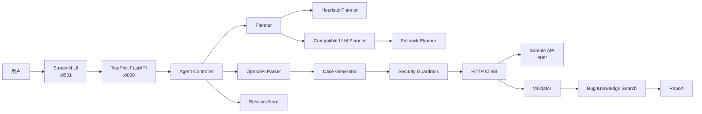
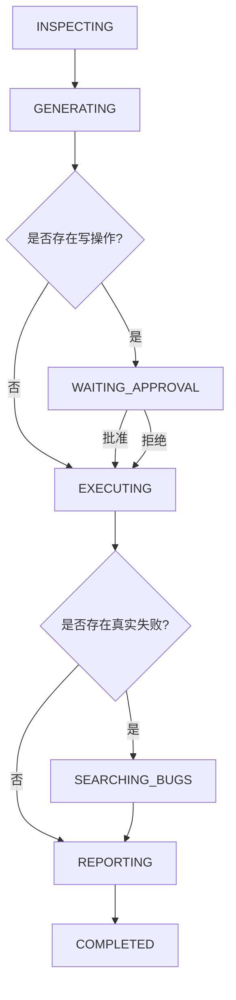

# TestPilot Lite

TestPilot Lite 是一个基于 **OpenAPI 驱动的智能 API 测试 Agent**。

它可以自动读取 API 契约、解析接口、生成测试用例、执行 HTTP 请求、验证响应结果、处理写操作人工审批、诊断失败原因，并最终生成测试报告。

项目将传统 API 自动化测试与 Agent 工作流结合，同时加入：

- Agent 状态机
- Tool 调用
- Human-in-the-loop 人工审批
- Heuristic Planner
- 可选 LLM Planner
- Planner Guardrail
- Planner Fallback
- Safe Retry Policy
- Exponential Backoff
- Idempotency
- Bug Knowledge Search
- Session Persistence
- Structured Logging
- pytest
- Planner Evaluation
- E2E
- GitHub Actions CI

项目定位：

> **以 API 自动化测试为业务场景的 Agent Engineering 项目**

也可以描述为：

> **Agentic API Testing Platform**

---

# 1. 项目目标

传统 API 测试通常需要测试人员手动完成：

```text
阅读 API 文档
↓
理解接口参数
↓
编写测试用例
↓
构造正常值和异常值
↓
发送 HTTP 请求
↓
检查状态码
↓
检查 Response Schema
↓
定位失败原因
↓
整理测试报告
```

TestPilot Lite 希望把这个过程变成一个可自动执行的 Agent 工作流：

```text
OpenAPI
↓
解析 API
↓
生成测试用例
↓
安全检查
↓
人工审批
↓
执行测试
↓
验证结果
↓
失败诊断
↓
生成报告
```

---

# 2. 系统架构

整个系统主要由三个服务组成：

```text
Browser
   ↓
Streamlit :8501
   ↓
TestPilot FastAPI :8000
   ↓
Sample API :8001
```

其中：

| 服务 | 作用 |
|---|---|
| `8501` | Streamlit 用户界面 |
| `8000` | TestPilot Agent 后端 |
| `8001` | 被 TestPilot 测试的 Sample API |
| `8002` | LLM Planner 实验时使用的兼容 LLM / Fake LLM 服务 |

系统架构：



---

# 3. API 测试数据流

TestPilot 的测试数据流为：

```text
OpenAPI
↓
OpenAPI Parser
↓
OperationSpec
↓
Case Generator
↓
TestCase
↓
Security
↓
HTTP Client
↓
ExecutionRecord
↓
Validator
↓
TestResult
```

这条链描述的是：

> 一个 API 最终如何变成测试结果。

---

# 4. Agent 控制流

Agent 本身还有另一条控制流：

```text
AgentState
↓
Planner
↓
ToolDecision
↓
Controller
↓
Tool
↓
修改 AgentState
↓
进入下一轮 Planner
```

可以理解成：

```text
观察当前状态
↓
决定下一步动作
↓
执行 Tool
↓
获得新状态
↓
继续思考下一步
```

也就是一个典型的 Agent Loop：

```text
State
→ Decision
→ Action
→ Observation
→ State
→ ...
```

---

# 5. Agent 状态机

TestPilot 使用显式状态机控制 Agent 工作流程。

主要 Phase：

```text
INSPECTING
↓
GENERATING
↓
WAITING_APPROVAL
↓
EXECUTING
↓
SEARCHING_BUGS
↓
REPORTING
↓
COMPLETED
```

另外还有：

```text
FAILED
```

状态机：



---

# 6. OpenAPI Parser

TestPilot 首先读取 OpenAPI 文档：

```text
/openapi.json
```

OpenAPI 中包含：

- Path
- HTTP Method
- Path Parameter
- Query Parameter
- Request Body
- Required 字段
- minimum
- Response Status
- Response Schema

Parser 会把复杂的 OpenAPI JSON 转换为内部结构：

```text
OperationSpec
```

例如：

```text
GET /products/{product_id}

Method:
GET

Path Parameter:
product_id: integer

Responses:
200
404
422
```

这样 Case Generator 就不需要直接操作复杂的 OpenAPI JSON。

---

# 7. Case Generator

Case Generator 的作用是：

```text
OperationSpec
↓
生成
↓
TestCase
```

一个 Operation 可以生成多个测试用例。

目前支持的测试类型包括：

- Happy Path
- Boundary
- Negative
- Not Found
- 非法 Path Parameter
- Missing Body
- Below Minimum

例如 OpenAPI Schema：

```json
{
  "type": "integer",
  "minimum": 1
}
```

Case Generator 可以自动生成：

```text
value = 0
```

并写入：

```text
expected_status = 422
```

形成边界测试。

---

# 8. TestCase

TestCase 可以理解为：

```text
测试输入
+
标准答案
```

例如：

```text
quantity = 0

expected_status = 422
```

TestPilot 并不是看到 `422` 就认为测试失败。

真正的判断是：

```text
Expected
vs
Actual
```

例如：

```text
Expected = 422
Actual   = 422
```

结果：

```text
PASS
```

所以：

> **HTTP Error Status ≠ Test Failure**

如果测试目标就是验证非法输入应该被服务器拒绝，那么 `422` 正是正确结果。

---

# 9. ExecutionRecord

HTTP Client 真正执行请求之后，会产生：

```text
ExecutionRecord
```

记录实际发生的事情，例如：

```text
actual_status
latency_ms
response_json
response_text
transport_error
blocked
```

可以理解为：

> TestCase 是标准答案，ExecutionRecord 是服务器的真实答卷。

---

# 10. Validator

Validator 会比较：

```text
TestCase
+
ExecutionRecord
```

最终产生：

```text
TestResult
```

验证内容不仅包括：

```text
Expected Status
vs
Actual Status
```

还包括：

```text
Response JSON
vs
OpenAPI Response Schema
```

例如：

```text
Expected Status = 200
Actual Status   = 200
```

但 Response Schema 不符合 OpenAPI：

```text
Schema Validation Failed
```

最终测试仍然会：

```text
FAIL
```

---

# 11. Passed / Failed / Blocked

TestPilot 明确区分三种测试结果。

## Passed

请求真正执行，并且实际结果符合预期：

```text
passed = True
blocked = False
```

---

## Failed

请求真正执行，但结果不符合预期：

```text
passed = False
blocked = False
```

例如：

```text
Expected = 200
Actual   = 404
```

---

## Blocked

请求没有真正执行，而是被安全策略阻止：

```text
blocked = True
```

例如：

```text
POST /orders
```

需要人工审批，但用户拒绝执行。

这种情况是：

```text
BLOCKED
```

而不是：

```text
FAILED
```

---

# 12. Human-in-the-loop

TestPilot 对写操作使用人工审批机制。

默认安全读取方法：

```text
GET
HEAD
OPTIONS
```

写操作：

```text
POST
PUT
PATCH
DELETE
```

需要 Human Approval。

流程：

```text
GENERATING
↓
发现 Write TestCase
↓
WAITING_APPROVAL
↓
返回前端
↓
用户批准 / 拒绝
```

批准：

```text
approval_granted = True
↓
EXECUTING
```

拒绝：

```text
Write TestCase
↓
blocked
```

这样 Agent 不会自行执行潜在危险的写操作。

---

# 13. Heuristic Planner

默认 Planner 为：

```text
HeuristicPlanner
```

它使用确定性的 Phase → Tool 映射：

| Phase | Tool |
|---|---|
| `INSPECTING` | `inspect_openapi` |
| `GENERATING` | `generate_test_cases` |
| `EXECUTING` | `execute_tests` |
| `SEARCHING_BUGS` | `search_bug_knowledge` |
| `REPORTING` | `save_report` |
| `COMPLETED` | `finish` |

例如：

```text
phase = GENERATING
```

一定得到：

```text
generate_test_cases
```

它的优点：

- 确定性
- 可重复
- 易测试
- 适合 pytest
- 适合 Evaluation
- 可以作为稳定 Baseline

---

# 14. CompatibleLLMPlanner

项目同时支持可选的：

```text
CompatibleLLMPlanner
```

LLM Planner 会接收 AgentState 摘要，例如：

```text
goal
phase
operation_count
case_count
result_count
failed_count
approval_granted
allowed_tools
```

然后输出：

```text
ToolDecision
```

包括：

```text
tool_name
arguments
reason
```

重要原则：

> LLM 只负责选择下一步 Tool。

LLM 本身不会直接执行 HTTP 请求。

---

# 15. Planner Guardrail

不能因为 LLM 返回了某个 Tool 就直接执行。

例如当前：

```text
phase = GENERATING
```

正确 Tool：

```text
generate_test_cases
```

但 LLM 返回：

```text
execute_tests
```

Guardrail 会检查：

```text
当前 Phase
↓
允许的 Tool
↓
LLM ToolDecision
```

发现不匹配：

```text
拒绝执行
```

因此：

> **LLM 有决策能力，但没有无限执行权限。**

---

# 16. FallbackPlanner

LLM 服务可能出现：

- Connection Error
- Timeout
- HTTP 500
- 非法 JSON
- Pydantic Validation Error
- 非法 Tool
- Phase / Tool 不匹配

如果 LLM Planner 无法正常工作：

```text
CompatibleLLMPlanner
↓
Failure
↓
FallbackPlanner
↓
HeuristicPlanner
↓
Agent 继续运行
```

正常情况下：

```text
CompatibleLLMPlanner
↓
合法 ToolDecision
↓
继续使用 LLM 决策
```

因此：

> LLM 是系统增强能力，而不是整个 Agent 的单点故障。

---

# 17. Security Guardrails

TestPilot 对 HTTP 执行进行了限制。

主要安全措施包括：

- Localhost / 本地目标限制
- Allowed Port 检查
- URL Validation
- 协议限制
- URL Credential 拒绝
- Redirect 禁止
- `follow_redirects=False`
- `trust_env=False`
- Timeout
- OpenAPI 最大大小限制
- Agent 最大步骤限制
- 最大测试用例数量限制
- 写操作人工审批
- Safe Retry Policy

设计原则：

> Planner 可以决定调用 Tool，但安全层仍然拥有最终执行控制权。

---

# 18. Safe Retry Policy

网络请求可能因为临时故障失败。

TestPilot 支持自动 Retry，但只允许安全的读取操作：

```text
GET
HEAD
OPTIONS
```

默认不自动 Retry：

```text
POST
PUT
PATCH
DELETE
```

原因是写请求可能产生副作用。

---

# 19. Retryable Errors

安全 Method 遇到以下 Transport Error 时可以 Retry：

```text
Timeout
Connection Error
Protocol Error
Transport Error
```

以下 HTTP Status 也被视为临时服务故障：

```text
502 Bad Gateway
503 Service Unavailable
504 Gateway Timeout
```

例如：

```text
GET + Timeout
→ Retry
```

```text
GET + 503
→ Retry
```

但：

```text
GET + 404
→ 不 Retry
```

因为资源不存在通常不会通过重复请求解决。

---

# 20. 为什么 POST 默认不能 Retry

例如：

```text
POST /orders
```

第一次请求：

```text
服务器已经创建订单
↓
Response 在网络途中丢失
↓
客户端收到 Timeout
```

客户端并不知道服务器是否已经完成操作。

如果立即 Retry：

```text
POST 第一次
→ Order A

POST 第二次
→ Order B
```

就可能造成重复订单。

因此 TestPilot 默认：

```text
POST + Timeout
→ 不自动 Retry
```

---

# 21. Exponential Backoff

Retry 不能连续瞬间轰击服务器。

TestPilot 使用：

```text
Exponential Backoff
```

例如基础时间：

```text
0.1 秒
```

Retry 时间：

```text
第 1 次 Retry
0.1 × 2^0
= 0.1 秒

第 2 次 Retry
0.1 × 2^1
= 0.2 秒

第 3 次 Retry
0.1 × 2^2
= 0.4 秒
```

流程：

```text
请求失败
↓
等待 0.1 秒
↓
Retry
↓
仍失败
↓
等待 0.2 秒
↓
Retry
```

这样可以减少：

```text
Retry Storm
```

也就是服务器已经过载时，大量客户端同时疯狂重试导致服务器更加拥堵。

---

# 22. Idempotency

为了进一步保护写操作，Sample API 对：

```text
POST /orders
```

实现了 Idempotency。

客户端可以发送：

```text
Idempotency-Key
```

例如：

```text
Idempotency-Key: order-test-001
```

第一次：

```text
POST /orders
↓
创建 Order 1
```

第二次使用：

```text
相同 Key
+
相同 Payload
```

服务器不会再次创建：

```text
Order 2
```

而是返回之前的结果。

如果：

```text
相同 Idempotency-Key
+
不同 Payload
```

则会拒绝冲突请求。

这样可以减少重复写操作造成的数据问题。

---

# 23. Bug Search

当存在真实失败：

```text
passed = False
blocked = False
```

Agent 会进入：

```text
SEARCHING_BUGS
```

当前 Bug Search 使用轻量级 Token Matching，而不是 Vector Database。

流程：

```text
Failure TestResult
↓
构造 Query
↓
Regex Tokenization
↓
Query Tokens
vs
Knowledge Entry Tokens
↓
计算 Token Overlap Score
↓
排序
↓
Top-K
↓
BugAdvice
```

Bug Knowledge 当前包含类似：

- `validation-422`
- `fixture-404`
- `schema-mismatch`
- `timeout-network`
- `unsafe-write`
- `method-not-allowed-405`
- `non-json-response`
- `unexpected-server-500`

---

# 24. Session Persistence

AgentState 不只存在内存。

SessionStore 会保存：

```text
AgentState
↓
JSON
↓
data/sessions/<session_id>.json
```

读取时：

```text
JSON
↓
AgentState
```

这样 Session 可以被后续 API 请求继续读取。

保存过程使用临时文件再 Replace 的方式降低写入过程中留下半个 JSON 文件的风险。

---

# 25. Structured Logging / Observability

项目提供基础结构化日志能力。

例如：

```text
event=http_retry
method=GET
url=http://127.0.0.1:8001/products
attempt=1
reason=ReadTimeout
```

日志采用：

```text
key=value
```

形式。

可以帮助观察：

- 当前 Agent Phase
- Tool
- HTTP Method
- URL
- Status
- Retry
- Retry Reason
- Latency
- Planner Fallback
- Session 状态

目前使用轻量级 Python Logging。

未来可以进一步升级为：

- JSON Logging
- OpenTelemetry
- Prometheus
- Grafana
- ELK

但这些不属于 v1.0 的必须功能。

---

# 26. TestPilot FastAPI API

TestPilot Backend 默认运行：

```text
http://127.0.0.1:8000
```

Swagger：

```text
http://127.0.0.1:8000/docs
```

主要 Endpoint：

---

## POST /sessions

创建新的 Agent Session。

```text
POST /sessions
```

流程：

```text
创建 AgentState
↓
Controller 开始运行
↓
INSPECTING
↓
GENERATING
↓
可能进入 WAITING_APPROVAL
```

---

## GET /sessions/{session_id}

查询当前 Session：

```text
GET /sessions/{session_id}
```

---

## POST /sessions/{session_id}/approve

审批写操作：

```text
POST /sessions/{session_id}/approve
```

批准后：

```text
approval_granted = True
↓
EXECUTING
```

如果 Session 当前状态不能审批，可能返回：

```text
409 Conflict
```

---

## GET /sessions/{session_id}/report

获取最终测试报告：

```text
GET /sessions/{session_id}/report
```

---

## GET /sessions/{session_id}/trace

查看 Agent 执行 Trace：

```text
GET /sessions/{session_id}/trace
```

可以看到类似：

```text
inspect_openapi
↓
generate_test_cases
↓
execute_tests
↓
search_bug_knowledge
↓
save_report
```

---

# 27. HTTP Status 含义

项目中常见状态码：

| Status | 含义 |
|---|---|
| `200` | 普通请求成功 |
| `201` | 新资源创建成功 |
| `404` | Session 或资源不存在 |
| `409` | 资源存在，但当前状态不允许操作 |
| `422` | JSON 可以解析，但字段验证失败 |

特别注意：

```text
422
```

本身不等于：

```text
Test Failed
```

是否失败仍然取决于：

```text
Expected vs Actual
```

---

# 28. Streamlit UI

Streamlit 默认运行：

```text
http://127.0.0.1:8501
```

UI 与系统关系：

```text
Browser
↓
Streamlit :8501
↓
TestPilot :8000
↓
Sample API :8001
```

UI 支持：

- 输入 OpenAPI URL
- 创建测试 Session
- 查看生成的 TestCase
- 人工审批写操作
- 查看 Passed
- 查看 Failed
- 查看 Blocked
- 查看执行结果
- 查看 Agent 状态
- 下载测试报告

---

# 29. 项目结构

项目结构大致如下：

```text
TestPilot-Lite/
│
├── testpilot/
│   ├── api.py
│   ├── bug_search.py
│   ├── case_generator.py
│   ├── config.py
│   ├── controller.py
│   ├── http_client.py
│   ├── logging_utils.py
│   ├── models.py
│   ├── openapi_parser.py
│   ├── planner.py
│   ├── reporting.py
│   ├── security.py
│   ├── store.py
│   └── validators.py
│
├── sample_api/
│   └── main.py
│
├── tests/
│
├── evaluation/
│
├── scripts/
│
├── data/
│
├── .github/
│   └── workflows/
│       └── ci.yml
│
├── ui.py
├── pyproject.toml
├── .gitignore
└── README.md
```

---

# 30. 本地环境安装

建议 Python：

```text
Python 3.11+
```

创建虚拟环境：

```powershell
python -m venv .venv
```

激活：

```powershell
.venv\Scripts\Activate.ps1
```

安装项目：

```powershell
python -m pip install -e .
```

---

# 31. 启动 Sample API

打开第一个 PowerShell：

```powershell
.venv\Scripts\python.exe -m uvicorn sample_api.main:app --host 127.0.0.1 --port 8001
```

Sample API：

```text
http://127.0.0.1:8001
```

Swagger：

```text
http://127.0.0.1:8001/docs
```

OpenAPI：

```text
http://127.0.0.1:8001/openapi.json
```

---

# 32. 启动 TestPilot Backend

打开第二个 PowerShell：

```powershell
.venv\Scripts\python.exe -m uvicorn testpilot.api:app --host 127.0.0.1 --port 8000
```

Swagger：

```text
http://127.0.0.1:8000/docs
```

---

# 33. 启动 Streamlit

打开第三个 PowerShell：

```powershell
.venv\Scripts\python.exe -m streamlit run ui.py
```

浏览器访问：

```text
http://127.0.0.1:8501
```

---

# 34. 正常 Demo 流程

启动：

```text
8001 Sample API
8000 TestPilot
8501 Streamlit
```

浏览器打开：

```text
http://127.0.0.1:8501
```

OpenAPI URL：

```text
http://127.0.0.1:8001/openapi.json
```

然后：

```text
分析接口
↓
INSPECTING
↓
OpenAPI Parser
↓
GENERATING
↓
Case Generator
↓
生成 TestCase
↓
WAITING_APPROVAL
↓
人工批准
↓
EXECUTING
↓
HTTP Client
↓
Validator
↓
REPORTING
↓
COMPLETED
```

如果存在真实失败：

```text
EXECUTING
↓
SEARCHING_BUGS
↓
BugAdvice
↓
REPORTING
↓
COMPLETED
```

---

# 35. pytest 自动化测试

运行全部测试：

```powershell
.venv\Scripts\python.exe -m pytest
```

显示详细测试名称：

```powershell
.venv\Scripts\python.exe -m pytest -vv
```

pytest 覆盖的功能包括：

- OpenAPI Parser
- Case Generator
- Boundary Generation
- Validator
- HTTP Client
- Retry
- Safe Retry Policy
- Backoff
- Idempotency
- Security
- Session Store
- Controller
- FastAPI API
- Planner
- Guardrail
- Fallback
- Bug Search
- Human Approval

---

# 36. MockTransport

pytest 中使用：

```text
httpx.MockTransport
```

模拟：

```text
Sample API :8001
```

例如 Mock 可以定义：

```text
GET /items
→ 200

GET /items/999999
→ 404

POST /orders
合法
→ 201

POST /orders
minimum 不合法
→ 422
```

Mock 不会自动理解 OpenAPI。

因此当真实 API 行为发生变化时：

```text
产品行为变化
↓
Mock Fixture
也需要同步变化
```

否则自动化测试可能因为 Mock 过时而失败。

---

# 37. Coverage

可以运行：

```powershell
.venv\Scripts\python.exe -m pytest --cov=testpilot
```

Coverage 用来观察：

```text
哪些代码真正被测试执行过
```

Coverage：

> 不是代码质量分数。

高 Coverage 不等于没有 Bug。

它主要帮助发现：

```text
哪些分支还没有测试
```

---

# 38. Planner Evaluation

运行：

```powershell
.venv\Scripts\python.exe -m evaluation.run_eval
```

其中一个核心指标：

```text
tool_selection_accuracy
```

它验证：

```text
给定 AgentState
↓
Planner
↓
是否选择正确 Tool
```

Heuristic Planner 作为稳定 Baseline，可以得到可重复的 Evaluation 结果。

---

# 39. E2E

运行：

```powershell
.venv\Scripts\python.exe -m scripts.e2e_check
```

E2E：

```text
End-to-End
```

验证的是整个系统链路：

```text
OpenAPI
↓
Parser
↓
Case Generator
↓
Approval
↓
Execution
↓
Validation
↓
Report
```

最终成功：

```text
E2E PASS
```

注意：

> E2E 脚本会自己启动所需服务。

所以运行 E2E 前，需要先关闭手动运行的：

```text
8000
8001
```

避免端口冲突。

---

# 40. GitHub Actions CI

项目包含：

```text
.github/workflows/ci.yml
```

每次 Push 到 GitHub 后，GitHub Actions 会自动运行：

```text
Checkout repository
↓
Set up Python
↓
Install dependencies
↓
Run pytest
↓
Run planner evaluation
↓
Run end-to-end check
```

正常情况下：

```text
✓ Run pytest
✓ Run planner evaluation
✓ Run end-to-end check
```

全部绿色。

这说明：

> 项目不仅能在本地电脑运行，也能够在 GitHub 提供的全新 CI 环境中从零安装并完成验证。

---

# 41. Git 工作流

修改代码以后：

```powershell
git status
```

添加修改：

```powershell
git add .
```

提交：

```powershell
git commit -m "描述这次修改"
```

上传：

```powershell
git push
```

之后：

```text
GitHub
↓
Actions
↓
TestPilot CI
```

检查自动化验证结果。

---

# 42. 为什么这是 Agent 项目

TestPilot Lite 并不只是：

```text
一堆 requests.get()
+
pytest
```

它拥有明确的 Agent 组成部分：

```text
AgentState
Planner
ToolDecision
Controller
Tools
State Machine
Human-in-the-loop
Trace
Persistence
LLM Planner
Guardrail
Fallback
```

Agent 的运行模式：

```text
读取 State
↓
Planner 决策
↓
选择 Tool
↓
Controller 执行 Tool
↓
修改 State
↓
继续下一轮
```

因此它更准确的定位是：

> **Agentic API Testing Platform**

也就是：

> **使用 Agent 架构实现的 API 自动化测试平台。**

---

# 43. 为什么不是纯运维项目

项目涉及：

- HTTP
- Logging
- Retry
- CI
- Reliability

这些确实和后端工程、SRE / 运维领域有交集。

但项目的核心业务并不是：

```text
服务器部署
监控集群
管理 Kubernetes
基础设施运维
```

核心仍然是：

```text
API 自动化测试
+
Agent Workflow
```

所以主要定位应该是：

```text
Agent Engineering
+
API Test Automation
```

而不是：

```text
传统运维项目
```

---

# 44. 设计原则

## Deterministic Core

核心执行逻辑保持确定性。

```text
Parser
Generator
Security
HTTP Client
Validator
```

不依赖 LLM 才能正常运行。

---

## LLM as Enhancement

LLM 是增强能力：

```text
LLM 正常
→ 使用 LLM Planner

LLM 失败
→ Fallback HeuristicPlanner
```

不会让整个系统依赖模型才能运行。

---

## Human-in-the-loop

危险操作由人决定：

```text
Write Operation
↓
WAITING_APPROVAL
↓
Human Decision
```

---

## Fail Safe

系统错误时优先：

```text
安全停止
```

而不是绕过 Guardrail。

---

## Safe Retry

Retry 必须满足：

```text
安全 Method
AND
临时故障
AND
还有 Retry 次数
```

而不是：

```text
请求失败
→ 无脑 Retry
```

---

## Explicit State

Agent 的运行状态明确存储在：

```text
AgentState
```

而不是依赖隐藏的聊天上下文。

---

# 45. 测试体系

TestPilot 使用多层测试体系：

```text
pytest
│
├── Unit Test
├── Integration Test
├── MockTransport
└── FastAPI TestClient

Planner Evaluation
│
└── Tool Selection

E2E
│
└── Full Workflow

GitHub Actions
│
└── Clean Environment CI
```

不同层解决不同问题。

---

## pytest

回答：

```text
单个组件是否工作正确？
```

---

## Evaluation

回答：

```text
Planner 是否选择了正确 Tool？
```

---

## E2E

回答：

```text
整个系统从头到尾能否跑通？
```

---

## CI

回答：

```text
换一台干净机器后，
整个项目还能不能通过？
```

---

# 46. 当前已完成功能

```text
OpenAPI Parser                 ✅
OperationSpec                  ✅
Automatic Case Generator       ✅
Happy Test                     ✅
Boundary Test                  ✅
Negative Test                  ✅
minimum - 1 Generation         ✅
HTTP Client                    ✅
Response Validation            ✅
JSON Schema Validation         ✅
Security Guardrails            ✅
Human-in-the-loop              ✅
Passed / Failed / Blocked      ✅
AgentState                     ✅
Agent State Machine            ✅
Controller Agent Loop          ✅
Heuristic Planner              ✅
Compatible LLM Planner         ✅
Planner Guardrail              ✅
Fallback Planner               ✅
Bug Knowledge Search           ✅
Session Persistence            ✅
Safe Retry Policy              ✅
Exponential Backoff            ✅
Idempotency                    ✅
Structured Logging             ✅
Streamlit UI                   ✅
pytest                         ✅
MockTransport                  ✅
Coverage                       ✅
Planner Evaluation             ✅
E2E                            ✅
Git                            ✅
GitHub                         ✅
GitHub Actions CI              ✅
```

---

# 47. 后续可能扩展

v1.0 不需要继续无限增加功能。

未来版本可以考虑：

## Case Generator

增加更多 OpenAPI Constraint：

```text
maximum + 1
minLength - 1
maxLength + 1
invalid enum
missing individual required field
```

---

## Bug Search

当前：

```text
Token Matching
```

未来可以升级：

```text
Embedding
↓
Vector Search
↓
RAG
```

---

## Observability

当前：

```text
Python Logging
+
key=value
```

未来可以：

```text
JSON Logging
OpenTelemetry
Prometheus
Grafana
```

---

## Infrastructure

未来可以加入：

```text
Docker
Docker Compose
Deployment
```

但这些不属于当前 v1.0 必须范围。

---

# 48. TestPilot Lite v1.0 的目标

v1.0 的目标不是：

> 实现所有测试平台、Agent、LLM 和运维功能。

而是实现一个：

```text
小型
+
完整
+
可解释
+
可测试
+
可重复
+
安全
+
具有 Agent 架构
```

的 API 智能测试平台。

目前的系统已经形成完整闭环：

```text
OpenAPI
↓
Parser
↓
Case Generator
↓
Human Approval
↓
Security
↓
HTTP Client
↓
Retry / Backoff
↓
ExecutionRecord
↓
Validator
↓
TestResult
↓
Bug Search
↓
Report
↓
Persistence
↓
UI
↓
pytest
↓
Evaluation
↓
E2E
↓
GitHub Actions CI
```

---

# 49. 项目状态

当前版本：

```text
TestPilot Lite v1.0 Release Candidate
```

核心开发：

```text
完成
```

自动化测试：

```text
通过
```

Planner Evaluation：

```text
通过
```

E2E：

```text
通过
```

GitHub Actions CI：

```text
通过
```

下一阶段：

```text
最终 v1.0 验收
↓
正式发布 v1.0.0
```

---

# License

本项目主要用于：

- Agent Engineering 学习
- API 自动化测试学习
- Python / FastAPI 实践
- 软件测试实践
- 项目作品集展示
- 面试项目讲解

